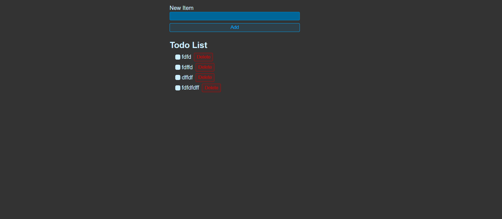

# React Todo List App

A simple and interactive Todo List application built with React. This project demonstrates essential React concepts such as state management with hooks (`useState`, `useEffect`), event handling, and working with browser localStorage to persist data.

---

## Features

- Add new todo items with a title.
- Mark todos as completed or pending using checkboxes.
- Delete todo items from the list.
- Persist todos in the browser’s localStorage so data is saved across page reloads.
- Real-time UI updates reflecting the current todo list state.
- Clean and minimal user interface.

---

## Technologies Used

- React (Functional components and hooks)
- JavaScript (ES6+)
- CSS for styling
- Browser localStorage for data persistence

---

## How It Works

- The app initializes the todo list from localStorage if available.
- Users can add new todos via a controlled input form.
- Each todo can be toggled between completed and not completed.
- Todos can be deleted individually.
- Any changes to the todo list are saved automatically to localStorage.

---

## Getting Started

1. **Clone the repository**
git clone https://github.com/thaanis-off/todo-app.git

2. **Navigate to the project directory**
cd todo-app

3. **Install dependencies**
npm i

4. **Start the development server**
npm run dev

